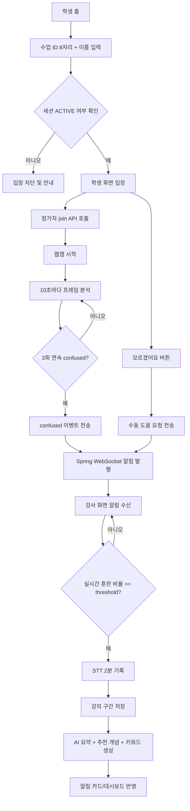

# iKnow Frontend

실시간 수업 이해도 감지와 강의 분석을 위한 React 프론트엔드입니다.  
학생 화면은 표정 기반 분석과 수동 도움 요청을 전송하고, 강사 화면은 실시간 알림을 받아 강의 구간을 기록·요약합니다. 대시보드는 반별 이해도 추이, 키워드, AI 코칭 리포트를 제공합니다.

## 기술 스택

| 항목 | 내용 |
|------|------|
| 번들러 | Vite 8 |
| 프레임워크 | React 19 |
| 라우팅 | React Router DOM 7 |
| HTTP | Axios |
| WebSocket | `@stomp/stompjs`, `sockjs-client` |
| 차트 | Recharts |
| 워드클라우드 | `d3-cloud` |
| 아이콘 | `react-icons` |
| 음성 인식 | Web Speech API |
| 오디오 입력 | MediaRecorder API |

## 핵심 기능

### 학생 화면

- 수업 ID와 이름을 입력해 활성 세션에만 입장
- 웹캠 프레임을 10초마다 캡처하여 AI 분석 요청
- 3회 연속 confused 감지 시 이해도 이벤트 전송
- 자동 감지 쿨다운 2분 적용
- `모르겠어요` 버튼으로 수동 도움 요청 전송
- 세션 종료 또는 비활성 상태 감지 시 자동 안내 및 화면 종료
- 페이지 이탈 시 학생 퇴장 API 전송

### 강사 화면

- PIN 인증 후 수업 시작
- 커리큘럼, 반 이름, 감지 기준 퍼센트 설정
- 활성 학생 수와 최근 confused 이벤트를 기반으로 실시간 이해 어려움 정도 계산
- STOMP/SockJS로 실시간 알림 수신
- 알림 구간 발생 시 Web Speech API로 약 2분간 강의 내용 기록
- STT 결과를 요약 API에 보내 AI 요약, 추천 개념, 키워드 생성
- 알림별 키워드 수정 및 저장
- 마이크 음소거/해제, 30분 무음 경고 제공
- 페이지 종료 시 세션 종료 비콘 전송

### 대시보드

- 날짜, 커리큘럼, 반 기준 필터링
- KPI, 반별 알림 수, 시간대별 이해 어려움 추이 제공
- 신호 유형 비율 시각화
- 키워드 워드클라우드 및 키워드별 리포트 조회
- 알림 이력 상세 조회
- AI 코칭 리포트 생성
- 커리큘럼 생성/삭제 관리

## 사용자 흐름



## 시스템 구성

```mermaid
flowchart LR
    Student[StudentPage\n웹캠 + 수동 요청] -->|REST| Spring[Spring Boot API]
    Student -->|REST| FastAPI[FastAPI AI]
    Instructor[InstructorPage\nWebSocket + STT + 요약 확인] -->|REST| Spring
    Instructor -->|REST| FastAPI
    Spring -->|STOMP /topic/alert/{sessionId}| Instructor
    Dashboard[DashboardPage\n통계/키워드/AI 코칭] -->|REST| Spring
    Dashboard -->|REST| FastAPI
```

## 페이지 구성

| 경로 | 설명 |
|------|------|
| `/` | 학생 입장 화면. 수업 ID와 이름 입력 |
| `/student/:sessionId` | 학생 실시간 감지 화면 |
| `/instructor` | 강사 실시간 수업 관리 화면 |
| `/dashboard` | 관리자/강사용 대시보드 |

## 실행 방법

```bash
npm install
cp .env.example .env
npm run dev
```

- 개발 서버 기본 주소: `http://localhost:5173`
- PowerShell에서는 `cp` 대신 `Copy-Item .env.example .env` 사용 가능
- 배포 빌드:

```bash
npm run build
```

## 환경 변수

```env
VITE_API_URL=http://52.78.190.57:8088
VITE_AI_URL=http://52.78.190.57:8000
VITE_INSTRUCTOR_PIN=1234
```

## 주요 API 연동

### Spring Boot

- `POST /api/sessions`
- `GET /api/sessions/:id`
- `POST /api/sessions/:id/terminate`
- `POST /api/sessions/:id/participants/join`
- `POST /api/sessions/:id/participants/leave`
- `GET /api/sessions/:id/alerts`
- `GET /api/sessions/:id/confused-events`
- `POST /api/confused-events`
- `POST /api/lecture-chunk`
- `POST /api/lecture-summary`
- `GET /api/alerts/:alertId/summary`
- `POST /api/understanding-difficulty-trends`
- `GET /api/dashboard/classes`
- `POST /api/dashboard/ai-coaching-data`
- `GET /api/dashboard/keyword-report`
- `GET /api/curriculums`
- `POST /api/curriculums`
- `DELETE /api/curriculums/:curriculumId`
- `DELETE /api/alerts/:alertId`

### FastAPI

- `POST /ai-api/analyze/:studentId`
- `POST /ai-api/summarize`
- `POST /ai-api/coaching`

## 주요 동작 규칙

- 학생 자동 감지:
  - 10초 간격 프레임 분석
  - 3회 연속 confused일 때 이벤트 전송
  - 자동 전송 후 2분 쿨다운
- 학생 수동 요청:
  - `모르겠어요` 버튼으로 즉시 전송
  - 버튼 자체도 2분 쿨다운
- 강사 알림 처리:
  - 최근 2분 confused 학생 수 / 활성 학생 수로 혼란 비율 계산
  - 혼란 비율이 수업 threshold 이상일 때만 알림 구간 기록
  - 음소거 전환 시 진행 중 STT 기록 중단
- PIN 인증:
  - 로컬 스토리지 기준 20분 유지

## 프로젝트 구조

```text
fe/
├─ public/
├─ src/
│  ├─ api/
│  │  └─ index.js
│  ├─ components/
│  │  ├─ CurriculumManagerModal.jsx
│  │  ├─ KeywordCloudPanel.jsx
│  │  ├─ PinModal.jsx
│  │  ├─ SessionSettingsModal.jsx
│  │  └─ UnderstandingDifficultyGauge.jsx
│  ├─ constants/
│  │  └─ curriculum.js
│  ├─ hooks/
│  │  ├─ useMicrophone.js
│  │  ├─ useSpeechRecognition.js
│  │  ├─ useStompAlert.js
│  │  └─ useWebcam.js
│  ├─ pages/
│  │  ├─ DashboardPage.jsx
│  │  ├─ HomePage.jsx
│  │  ├─ InstructorPage.jsx
│  │  └─ StudentPage.jsx
│  ├─ utils/
│  │  └─ seoulTime.js
│  ├─ App.jsx
│  ├─ App.css
│  ├─ index.css
│  └─ main.jsx
├─ .env.example
├─ package.json
└─ vite.config.js
```

## 참고 사항

- STT는 브라우저의 Web Speech API를 사용하므로 Chrome/Edge 계열 환경을 권장합니다.
- WebSocket 연결 주소는 `VITE_API_URL + /ws` 입니다.
- `vite.config.js`에서 `global: 'globalThis'`를 정의해 `sockjs-client` 호환성을 맞춥니다.
